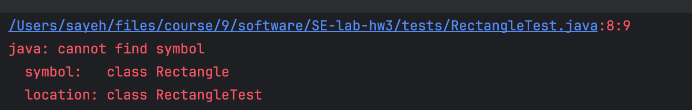

# گزارش آزمایش
## مرحله اول 

برای این برنامه ابتدا تست مربوط به محاسبه مساحت مستطیل را به صورت زیر می‌نویسیم. توجه داریم که هنوز کلاس مستطیل را نساخته ایم. 

```java
import org.junit.jupiter.api.Test;
import static org.junit.jupiter.api.Assertions.assertEquals;

public class RectangleTest {

    @Test
    public void testComputeArea() {
        Rectangle rectangle = new Rectangle(3, 6);
        double actualArea = rectangle.computeArea();
        assertEquals(18, actualArea, 0);
    }

}
```

همانطور که در تصویر زیر مشاهده می‌کنیم،‌در کامپایل به مشکل میخوریم زیرا کلاس مستطیل وجود ندارد. 


حال بر اساس تستی که در قسمت قبل نوشتیم، کلاس Rectangle را مینویسیم. دقت شود که در ابتدا تابع computeArea() را نمینویسیم.

```java
public class Rectangle {
    private int width;
    private int height;

    public Rectangle(int width, int height) {
        this.width = width;
        this.height = height;
    }

    public int computeArea() {
        return 0;
    }
}
```
حال پس از اجرای تست مشاهده میشود که ارور از ارور کامپایل به ران تایم تبدیل میشود. درواقع در assert مشکل وجود دارد زیرا computeArea() اشتباه است.

#عکس


حال پس از درست کردن تابع قبل داریم:

#عکس

## مرحله دوم
اکنون برای مرحله بعدی برای ایجاد امکان تغییر طول و عرض مستطیل توسط کاربر ابتدا تغییرات زیر را میدهیم:

```java
public class RectangleTest {

    @Test
    public void testComputeArea() {
        Rectangle rectangle = new Rectangle(3, 6);
        double actualArea = rectangle.computeArea();
        assertEquals(18, actualArea, 0);
    }

    @Test
    public void testRectangleGetWidth() {
        Rectangle rectangle = new Rectangle(3, 6);
        assertEquals(3, rectangle.getWidth());
    }

    @Test
    public void testRectangleGetHeight() {
        Rectangle rectangle = new Rectangle(3, 6);
        assertEquals(6, rectangle.getHeight());
    }

    @Test
    public void testRectangleSetWidth() {
        Rectangle rectangle = new Rectangle(3, 6);
        rectangle.setWidth(4);
        assertEquals(4, rectangle.getWidth());
    }

    @Test
    public void testRectangleSetHeight() {
        Rectangle rectangle = new Rectangle(3, 6);
        rectangle.setHeight(8);
        assertEquals(8, rectangle.getHeight());
    }
}
```

حال کد مربوطه در کلاس Rectangle را پیاده سازی میکنیم:

```java
public class Rectangle {
    private int width;
    private int height;

    public Rectangle(int width, int height) {
        this.width = width;
        this.height = height;
    }

    public int computeArea() {
        return this.width * this.height;
    }

    public int getWidth() {
        return width;
    }

    public int getHeight() {
        return height;
    }

    public void setWidth(int width) {
        this.width = width;
    }

    public void setHeight(int height) {
        this.height = height;
    }
}
```

حال مشاهده میشود تست ها به درستی اجرا می شوند.

#عکس

## مرحله سوم

در این مرحله بر اساس SOLID باید یک اینترفیس Shape اضافه کنیم که Rectangle و Square از آن به ارث ببرند.

ابتدا تست ها را اضافه میکنیم:

```java
public class SquareTest {

    @Test
    public void testComputeArea() {
        Square square = new Square(4);
        double actualArea = square.computeArea();
        assertEquals(16, actualArea, 0);
    }

    @Test
    public void testSquareSetEdge(){
        Square square = new Square(4);
        square.setEdge(5);
        assertEquals(25, square.computeArea());
    }

    @Test
    public void testSquareGetEdge(){
        Square square = new Square(4);
        assertEquals(4, square.getEdge());
    }
}
```
همانطور که می‌بینید تست‌ها پاس نمی‌شوند و دوباره کامپایل ارور می‌خوریم چون Square نداریم.

#عکس

حال برای ادامه طبق توضیحات بالا Shape را درست میکنیم.

```java
public abstract class Shape {
    public abstract int computeArea();
}
```

سپس کلاس Square را اضافه میکنیم:

```java
public class Square extends Shape {
    private int edge;

    public Square(int edge) {
        this.edge = edge;
    }

    @Override
    public int computeArea() {
        return this.edge * this.edge;
    }

    public int getEdge() {
        return edge;
    }

    public void setEdge(int edge) {
        this.edge = edge;
    }
}
```

حال تغییرات مربوطه در کلاس Rectangle را میدهیم:
```java
public class Rectangle extends Shape {
    
}
```

حال میتوان دید تمام تست ها به درستی اجرا می شوند.

#عکس

# پرسش‌ها
## پرسش اول
خیر، این دو روش با یکدیگر تناقض ندارند بلکه به دو رویکرد مختلف برای توسعه نرم‌افزار اشاره دارند. این دو روش یکدیگر را تکمیل می‌کنند تا به توسعه نرم‌افزار با کیفیت و قابل اطمینان کمک کنند. در روش TDD، تست‌ها قبل از پیاده‌سازی نرم‌افزار نوشته می‌شوند تا مشکلات را در مراحل اولیه شناسایی کنند و اطمینان حاصل شود که کد پس از تغییرات همچنان با انتظارات مطابقت دارد:

**روش عمومی:**
   - در این روش، نرم‌افزار ابتدا پیاده‌سازی می‌شود، سپس آزمون نرم‌افزار (Software Testing) انجام می‌شود.
   - آزمون نرم‌افزار در اینجا ممکن است به صورت دستی یا با استفاده از ابزارهای خودکار صورت گیرد.
   - این روش ممکن است باعث پیدا شدن خطاها و اشکالات در مراحل مختلف توسعه شود اما ممکن است ایجاد نیاز به تغییرات گسترده و پیچیده‌تر در کد برنامه را در مراحل بعدی بخواهد.

**روش TDD (توسعه مبتنی بر تست):**
   - در این روش، ابتدا واحد‌های کوچکی از کد (معمولاً توابع یا متدها) نوشته می‌شوند و سپس برای آنها تست (unit test) نوشته می‌شود.
   - تست‌ها به عنوان یک مستند مشخص می‌کنند که کد انتظارات چه خصوصیاتی را باید داشته باشد.
   - سپس کد برنامه به گونه‌ای تغییر داده می‌شود که تست‌ها با موفقیت اجرا شوند.
   - این فرآیند به صورت تکراری ادامه پیدا می‌کند تا کل برنامه پیاده‌سازی شود.


## پرسش دوم
آزمون‌های واحد (Unit Testing) معمولاً در ریزدانه نسبت به کد انجام می‌شوند و برای اطمینان از صحت عملکرد واحدهای کوچک کد مورد استفاده قرار می‌گیرند.

**ریزدانه (Fine-Grained):**
در این حالت، آزمون‌های واحد به صورت خیلی جزئی و دقیق بر روی واحدهای کوچک کد انجام می‌شوند. به عنوان مثال، فرض کنید یک تابع جستجوی خطا (Error Search Function) داریم که خطاهای مشخصی در یک لاگ را پیدا می‌کند. آزمون‌های واحد در اینجا ممکن است شامل تست‌هایی باشد که برای تابعهای مختلف این جستجوی خطا انجام می‌شود تا اطمینان حاصل شود که هر قسمت از تابع به درستی کار می‌کند.

**درشت‌دانه (Coarse-Grained):**
در مقابل، آزمون‌های واحد با درشت‌دانگی بیشتر وسیع‌تر انجام می‌شوند و ممکن است به تعداد وسیعی از واحدهای کد شامل شود. به عنوان مثال، اگر یک کلاس مدیریت محتوا (Content Management Class) داریم که وظیفه‌ی مدیریت افزودن، حذف و ویرایش محتوا را دارد، آزمون‌های واحد در اینجا می‌توانند تست‌هایی باشند که اطمینان حاصل کنند که تمام این عملیاتها به درستی انجام می‌شوند و اطلاعات مورد نیاز به صورت صحیح ذخیره و بازیابی می‌شوند.
